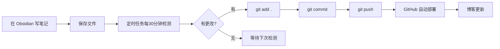

> 自动检测 Quartz content 文件夹变化，定时提交并推送到 GitHub

## 一、概述

本方案通过 Windows 任务计划程序创建定时任务，每 30 分钟自动检测 `content` 文件夹的变更，如有修改则自动执行 `git add`、`git commit`、`git push`。

### 优点
- ✅ 一次配置，永久生效
- ✅ 关机重启后自动恢复运行
- ✅ 后台静默执行，不影响正常工作
- ✅ 无需手动操作，写完笔记自动同步

## 二、创建脚本文件

### 1. 自动提交脚本 `auto-commit.ps1`

保存路径：`C:\Users\iamno\work\git\quartz\auto-commit.ps1`

```powershell
# auto-commit.ps1
# Automatically detect changes in content folder and commit to GitHub

param(
    [string]$Message = "Auto sync $(Get-Date -Format 'yyyy-MM-dd HH:mm:ss')"
)

$quartzPath = "C:\Users\iamno\work\git\quartz"

Set-Location $quartzPath

$status = git status --porcelain

if ($status) {
    Write-Host "[$(Get-Date -Format 'HH:mm:ss')] Changes detected, committing..." -ForegroundColor Green
    Write-Host "Changed files:" -ForegroundColor Yellow
    git status --short
    git add .
    git commit -m "$Message"
    git push
    Write-Host "[$(Get-Date -Format 'HH:mm:ss')] Commit successful!" -ForegroundColor Green
    Write-Host ""
} else {
    Write-Host "[$(Get-Date -Format 'HH:mm:ss')] No changes, skipped." -ForegroundColor Gray
}
```

### 2. 定时任务安装脚本 `setup-scheduled-task.ps1`

保存路径：`C:\Users\iamno\work\git\quartz\setup-scheduled-task.ps1`

```powershell

# setup-scheduled-task.ps1
# Create Windows scheduled task to automatically detect and commit every 30 minutes
$taskName = "Obsidian auto commit"
$scriptPath = "C:\Users\iamno\work\git\quartz\auto-commit.ps1"
# Action: the command to execute
$action = New-ScheduledTaskAction -Execute "powershell.exe" -Argument "-NoProfile -ExecutionPolicy Bypass -File `"$scriptPath`""
# Trigger: run every 30 minutes, starting now
$trigger = New-ScheduledTaskTrigger -Once -At (Get-Date) -RepetitionInterval (New-TimeSpan -Minutes 30)
# Settings: allow to run on battery power without stopping
$settings = New-ScheduledTaskSettingsSet -AllowStartIfOnBatteries -DontStopIfGoingOnBatteries
# Register the task
Register-ScheduledTask -TaskName $taskName -Action $action -Trigger $trigger -Settings $settings -Description "Auto-check Quartz content folder for changes and commit to GitHub"
Write-Host "Scheduled task created successfully!" -ForegroundColor Green
Write-Host "Task name: $taskName" -ForegroundColor Yellow
Write-Host "Execution interval: every 30 minutes" -ForegroundColor Yellow
Write-Host ""
Write-Host "You can view or edit this task in Task Scheduler." -ForegroundColor Cyan

```
## 三、配置 Git 免密（重要）

为避免定时任务运行时弹出密码窗口，需要配置 Git 免密登录。

### 方法一：SSH（推荐）

```bash

# 1. 修改远程地址为 SSH
git remote set-url origin git@github.com:sarawang9012/blog.git
# 2. 测试连接
ssh -T git@github.com

```
### 方法二：缓存密码

```bash

# 设置密码缓存 1 小时
git config --global credential.helper cache
# 或永久存储（不太安全）
git config --global credential.helper store

```
### 方法三：使用 Personal Access Token

1. GitHub → Settings → Developer settings → Personal access tokens
2. Generate new token (classic)
3. 勾选 `repo` 权限
4. 复制 token
5. 在 Git 推送时使用 token 作为密码

## 四、安装定时任务

### 步骤 1：以管理员身份打开 PowerShell

- 右键点击开始菜单 → Windows PowerShell (管理员)
- 或搜索 `PowerShell` → 右键 → 以管理员身份运行

### 步骤 2：执行安装脚本

```powershell
cd C:\Users\iamno\work\git\quartz
powershell.exe -ExecutionPolicy Bypass -File .\setup-scheduled-task.ps1
```
### 步骤 3：验证任务创建成功

```powershell
# 查看任务是否存在
Get-ScheduledTask -TaskName "Obsidian auto commit"
# 查看任务详情
Get-ScheduledTask -TaskName "Obsidian auto commit" | Format-List
```
## 五、手动创建定时任务（备选方案）

如果脚本执行失败，可以手动创建：

1. 按 `Win + R`，输入 `taskschd.msc`，回车
2. 右侧点击 **创建任务**
3. 常规选项卡：
    - 名称：`Obsidian auto commit`
    - 勾选 **不管用户是否登录都要运行**
4. 触发器选项卡：
    - 新建 → 开始任务：**按预定计划**
    - 设置：**每天**
    - 勾选 **重复任务间隔**：`30分钟`
    - 持续时间：**无限期**
5. 操作选项卡：
    - 新建 → 操作：**启动程序**
    - 程序：`powershell.exe`
    - 参数：`-NoProfile -ExecutionPolicy Bypass -File "C:\Users\iamno\work\git\quartz\auto-commit.ps1"`
6. 点击 **确定**

## 六、测试与验证

### 测试自动提交脚本

```powershell
cd C:\Users\iamno\work\git\quartz
powershell.exe -ExecutionPolicy Bypass -File .\auto-commit.ps1
```
预期输出：

```text
[17:43:40] No changes, skipped.
```
如有更改：

```text
[17:43:40] Changes detected, committing...
Changed files:
 M content/example.md
[17:43:41] Commit successful!
```
### 手动运行定时任务

```powershell
Start-ScheduledTask -TaskName "Obsidian auto commit"
```
### 查看任务运行历史

```powershell
Get-ScheduledTask -TaskName "Obsidian auto commit" | Get-ScheduledTaskInfo
```
输出示例：

| 字段                 | 说明      |
| ------------------ | ------- |
| LastRunTime        | 上次运行时间  |
| LastTaskResult     | 0 表示成功  |
| NextRunTime        | 下次运行时间  |
| NumberOfMissedRuns | 错过的运行次数 |

## 七、常用管理命令

| 操作   | 命令                                                                          |
| ---- | --------------------------------------------------------------------------- |
| 查看任务 | `Get-ScheduledTask -TaskName "Obsidian auto commit"`                        |
| 手动运行 | `Start-ScheduledTask -TaskName "Obsidian auto commit"`                      |
| 停止任务 | `Stop-ScheduledTask -TaskName "Obsidian auto commit"`                       |
| 禁用任务 | `Disable-ScheduledTask -TaskName "Obsidian auto commit"`                    |
| 启用任务 | `Enable-ScheduledTask -TaskName "Obsidian auto commit"`                     |
| 删除任务 | `Unregister-ScheduledTask -TaskName "Obsidian auto commit" -Confirm:$false` |

## 八、修改执行频率

编辑 `setup-scheduled-task.ps1`，修改 `-Minutes` 后的数字：

```powershell
# 每 5 分钟执行一次
$trigger = New-ScheduledTaskTrigger -Once -At (Get-Date) -RepetitionInterval (New-TimeSpan -Minutes 5)
# 每 1 小时执行一次
$trigger = New-ScheduledTaskTrigger -Once -At (Get-Date) -RepetitionInterval (New-TimeSpan -Hours 1)
```
修改后需要重新运行安装脚本（会覆盖原有任务）。

## 九、常见问题

### Q1: 关机重启后任务还在吗？

**答：** 是的，定时任务永久保存在 Windows 系统中，重启后自动恢复。

### Q2: 任务执行时弹出命令行窗口？

**答：** 默认会有窗口一闪而过。如需完全静默，可在参数中添加 `-WindowStyle Hidden`：

```powershell
$action = New-ScheduledTaskAction -Execute "powershell.exe" -Argument "-NoProfile -WindowStyle Hidden -ExecutionPolicy Bypass -File `"$scriptPath`""
```
### Q3: 提示"没有权限"或"执行策略被禁止"？

**答：** 以管理员身份运行 PowerShell，执行：

```powershell
Set-ExecutionPolicy RemoteSigned -Scope CurrentUser
```
### Q4: 推送失败，提示需要输入密码？

**答：** 需要配置 Git 免密登录，参考第三节。

### Q5: 笔记本合盖后任务不执行？

**答：** 这是电源管理设置。在任务设置中添加：

```powershell
$settings = New-ScheduledTaskSettingsSet -AllowStartIfOnBatteries -DontStopIfGoingOnBatteries -WakeToRun
```
`-WakeToRun` 参数会唤醒电脑执行任务。

## 十、完整工作流


## 十一、文件结构总结

```text
C:\Users\iamno\work\git\quartz/
├── content/                    ← Obsidian Vault（博客内容）
├── auto-commit.ps1            ← 自动提交脚本
├── setup-scheduled-task.ps1   ← 定时任务安装脚本
├── quartz.config.ts           ← Quartz 配置
└── .github/workflows/         ← GitHub Actions 部署配置

```
---

_配置日期：2026年4月20日_  
_版本：1.0_